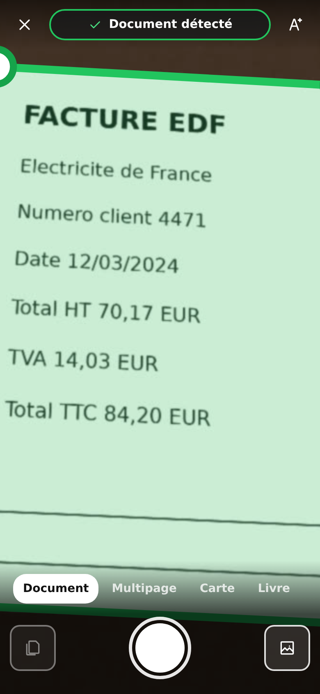
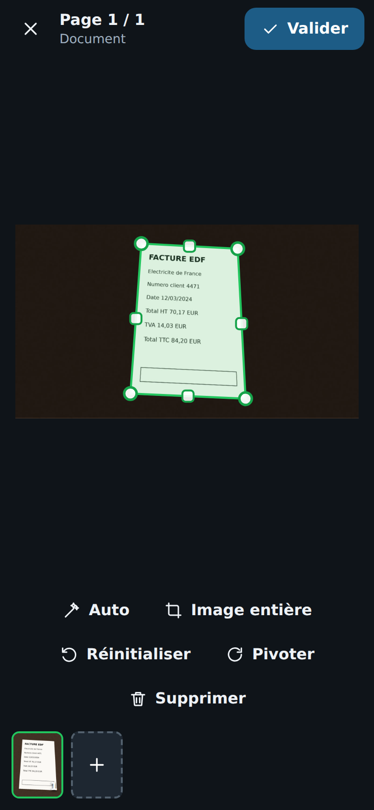
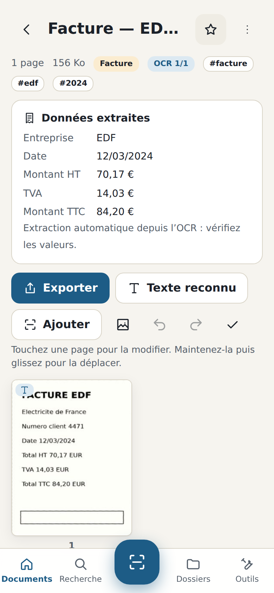
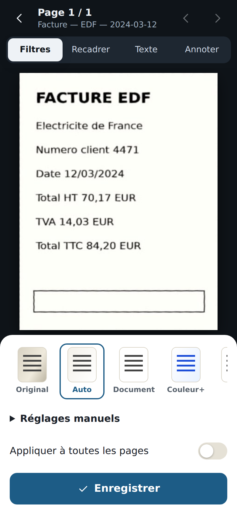
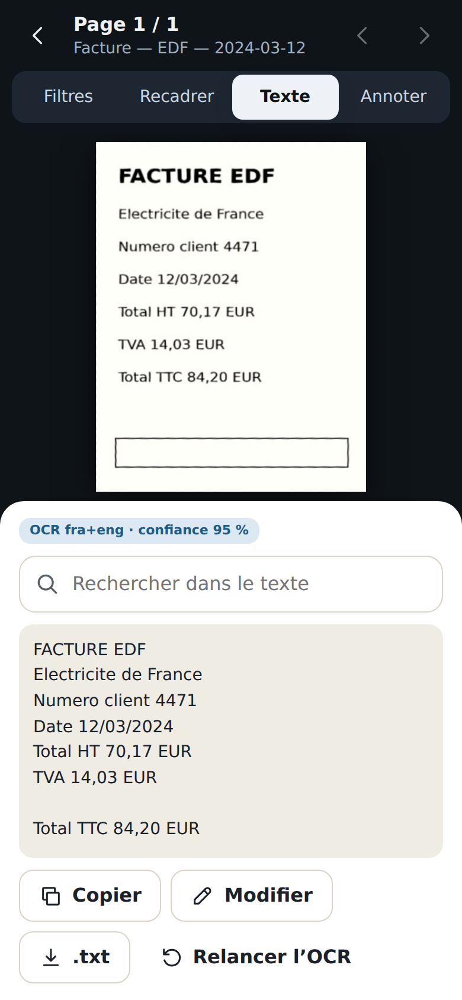
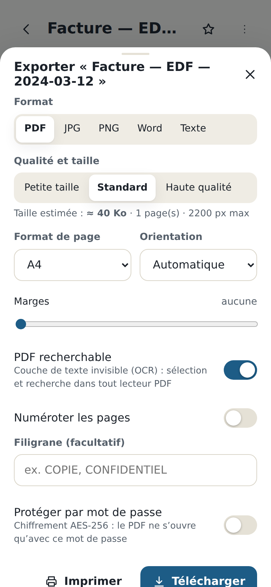
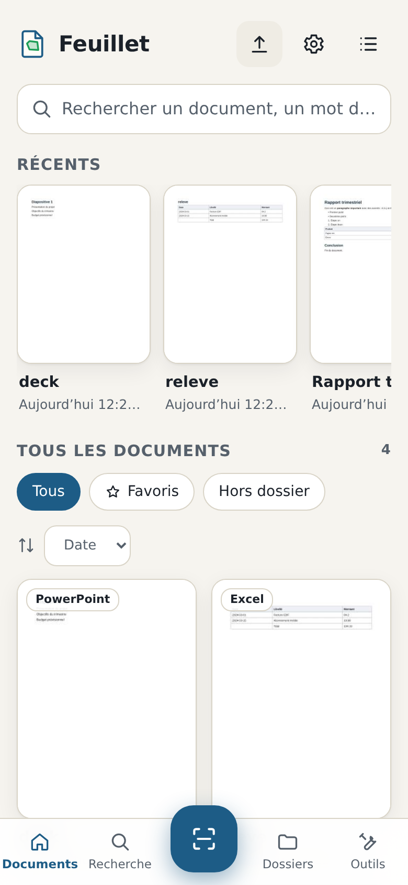
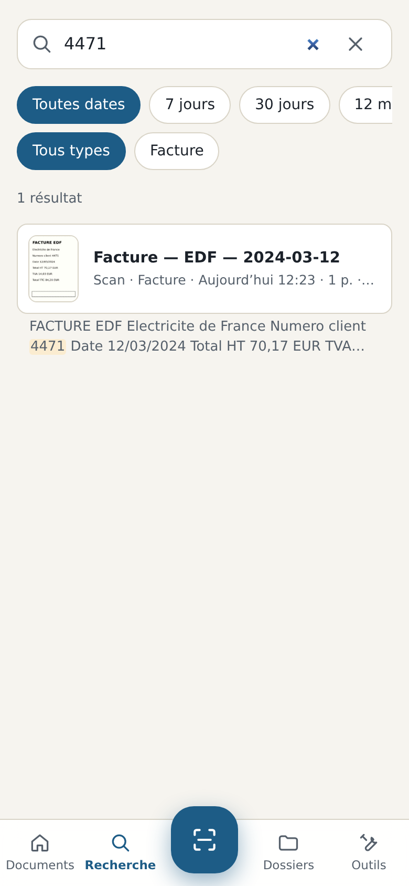

# Feuillet — scanner de documents local-first

Feuillet transforme un téléphone (ou un ordinateur) en scanner de documents complet :
détection **en temps réel** des quatre coins d’une feuille, capture automatique, redressement
de la perspective, filtres de lisibilité, documents multipages, **vrais PDF** (recherchables,
chiffrables), **OCR hors ligne**, recherche plein texte, dossiers, corbeille, historique,
annotations et signature.

Tout s’exécute **dans le navigateur, sur l’appareil** : aucun compte, aucun serveur, aucun
document envoyé. L’application est une **PWA installable** qui fonctionne hors ligne.

**Android : téléchargez l’APK dans les [Releases](https://github.com/ghilesaimeur951-creator/feuillet/releases/latest)**
(fichier `feuillet-x.y.z.apk`, voir [Application Android](#application-android-apk)).

**Version web : https://ghilesaimeur951-creator.github.io/feuillet/** (ouvrez-la sur votre
téléphone, autorisez la caméra, puis *Partager → Sur l’écran d’accueil* ou *Installer
l’application*).

| Scanner (détection temps réel) | Recadrage manuel | Document + OCR + facture | Filtres |
|---|---|---|---|
|  |  |  |  |

| Texte reconnu | Export PDF | Bibliothèque | Recherche dans le contenu |
|---|---|---|---|
|  |  |  |  |

> Captures réalisées automatiquement par les tests de bout en bout, avec une caméra simulée
> filmant une facture fictive posée en perspective sur une table.

---

## Sommaire

1. [Fonctionnalités](#fonctionnalités)
2. [Démarrage rapide](#démarrage-rapide)
3. [Utiliser le scanner](#utiliser-le-scanner)
4. [Stack et architecture](#stack-et-architecture)
5. [Scripts](#scripts)
6. [Tests](#tests)
7. [Déploiement](#déploiement) · [Application Android (APK)](#application-android-apk)
8. [Confidentialité et sécurité](#confidentialité-et-sécurité)
9. [Services externes](#services-externes)
10. [Limitations connues](#limitations-connues)
11. [Structure du dépôt](#structure-du-dépôt)
12. [Licence](#licence)

---

## Fonctionnalités

### Numérisation
- **Détection temps réel** des coins P1 (haut gauche) → P4 (bas gauche) sur le flux caméra,
  quadrilatère vert semi-transparent, poignées, **stabilisation temporelle** (pas de tremblement),
  aucun contour inventé quand rien de fiable n’est trouvé.
- Pipeline de vision réel (Web Worker) : niveaux de gris → flou gaussien → Canny adaptatif →
  composantes connexes → enveloppe convexe → approximation à 4 sommets → **raffinement sous-pixel**
  des bords → score multi-critères (aire, angles, support des arêtes, contraste, remplissage,
  centrage) → stabilisation. Précision médiane **0,7 px** sur des images de 360 px, ≈ 25 ms/image.
- **Capture automatique** quand le document est détecté, net, stable (anneau de progression),
  bouton de capture manuelle, **scanner continu** multipage (attend le changement de page).
- Indicateurs en direct : **flou**, **trop sombre**, **reflet**, **document hors cadre**
  (texte + icône + couleur : l’information ne passe jamais par la couleur seule).
- Lampe (torche) quand l’appareil le permet ; capture en pleine résolution du capteur (ImageCapture)
  avec re-détection des coins sur la photo haute définition.
- **Modes** : Document, Multipage, Carte, Livre (double page scindée en deux), Tableau blanc, Photo,
  Reçu/facture.
- **Recadrage manuel** : 4 coins indépendants + poignées de côté, **loupe** pendant le déplacement,
  clavier (flèches, Maj pour les grands pas), boutons *Auto*, *Image entière*, *Réinitialiser*,
  rotation.
- **Correction de perspective** par homographie (DLT) et échantillonnage bilinéaire — pas un simple
  recadrage — avec détection du ratio A4/Letter/carte.

### Traitement d’image
- Préréglages : **Original, Auto, Document, Couleur+, N&B, Gris**.
- Réglages : luminosité, contraste, exposition, saturation, netteté, **réduction du bruit / moiré**.
- Correction des ombres et blanchiment du fond (estimation de l’éclairage), binarisation adaptative
  (Sauvola), balance des blancs, masque flou.
- **Orientation automatique** : une page à l’envers ou tournée est redressée (analyse des lignes
  de texte + confiance OCR).

### Documents
- Multipage : ajouter (scan ou images), supprimer, dupliquer, pivoter, rescanner, remplacer,
  **glisser-déposer** pour réordonner (souris, tactile, clavier Alt+←/→), filtre par page ou pour
  toutes, **annuler/rétablir**.
- **Annotations** vectorielles (dessin libre, surligneur, texte, rectangle, ellipse, flèche, image)
  et **signature** (dessinée au doigt/souris/stylet avec pression, ou importée avec fond rendu
  transparent), déplaçables et redimensionnables.
- Outils : **fusionner**, **diviser**, **extraire des pages**, **supprimer les pages blanches**,
  **détecter les doublons** (empreinte perceptuelle).

### PDF et exports
- **Vrais PDF** (writer maison, validé par `qpdf --check`) : multipage, A4 / Letter / taille
  automatique, portrait / paysage / auto, marges, 3 profils (*Petite taille*, *Standard*,
  *Haute qualité*) avec **estimation de la taille**.
- **PDF recherchable** : couche de texte OCR invisible positionnée sous l’image.
- **Mot de passe PDF** : chiffrement **AES-256** (ISO 32000-2, révision 6).
- **Documents verrouillés** dans l’application : pages, texte OCR, notes, étiquettes et fichier
  original chiffrés au repos (AES-256-GCM, clé dérivée du mot de passe par PBKDF2-SHA-256,
  600 000 itérations). Ouverture temporaire : le document est verrouillé à nouveau dès qu’on le
  quitte ou après une minute en arrière-plan.
- Filigrane, numérotation des pages.
- Export **PDF, JPG, PNG** (ZIP si plusieurs pages), **TXT**, **DOCX** (images + texte),
  fichier original importé. **Téléchargement**, **partage natif** (Web Share), **impression**.

### Import et conversions
- Photos (une ou plusieurs → un document multipage ou un par photo), avec détection et redressement
  automatiques ; **glisser-déposer** sur ordinateur.
- **PDF** (rendu fidèle par pdf.js + extraction de la couche texte, PDF protégés par mot de passe).
- **DOCX, XLSX, PPTX, TXT** convertis en vraies pages mises en page (titres, gras, listes,
  tableaux, images, feuilles, diapositives) avec leur texte indexé et sélectionnable dans le PDF.
- Détection du **type réel** des fichiers (octets magiques), jamais par la seule extension.

### OCR et recherche
- **Tesseract 5 (WebAssembly)** avec modèles **français, anglais, espagnol, allemand, italien**
  embarqués — hors ligne, sur l’appareil. Architecture prête pour d’autres langues.
- Texte : afficher, rechercher, **copier**, **modifier**, exporter ; résultats stockés dans le document.
- **Classification** automatique (facture, reçu, devis, contrat, relevé, fiche de paie, ordonnance,
  pièce d’identité, courrier, impôts), **nom automatique** (« Facture — EDF — 2024-03-12 »),
  **étiquettes suggérées**.
- **Extraction structurée** facture/reçu : entreprise, n°, date, HT, TVA, TTC, devise.
- **Moteur de recherche** plein texte : titre, dossier, étiquettes, notes, texte OCR, type, date ;
  insensible aux accents et à la casse, préfixes (saisie en cours), tolérance aux fautes (OCR),
  expressions exactes entre guillemets, extraits surlignés, filtres type/période.

### Bibliothèque
- Accueil : récents, tous, favoris, hors dossier, dossiers ; **grille ou liste** ; tri par
  date / nom / taille / type ; sélection multiple (déplacer, fusionner, supprimer).
- **Dossiers et sous-dossiers** (créer, renommer, déplacer, supprimer, restaurer), **étiquettes**,
  **notes**, **favoris**, **corbeille** (purge automatique après 30 jours), **historique**
  (créé, ouvert, modifié, importé, exporté, OCR…).
- **Sauvegarde / restauration** complète en ZIP.
- **Récupération après interruption** : un scan en cours est sauvegardé à chaque prise de vue et
  proposé à la reprise au redémarrage.

### Application
- PWA installable, **hors ligne** (service worker), responsive (téléphone, tablette, ordinateur),
  thèmes **clair / sombre / système**, raccourcis clavier, squelettes de chargement, notifications,
  confirmations avant suppression, états vides, messages d’erreur explicites.

---

## Démarrage rapide

Prérequis : **[Bun](https://bun.sh) ≥ 1.2** (outil unique : dépendances, build, serveur, tests).

```bash
git clone <url-du-dépôt> feuillet && cd feuillet
bun install
bun run dev            # http://localhost:5173, reconstruction automatique
```

Production :

```bash
bun run build          # → dist/ (site statique)
bun run preview        # sert dist/ sur http://localhost:4173
```

Vérifications :

```bash
bun run check          # type-check + lint + tests unitaires
bun run test:e2e       # build + tests de bout en bout (Chromium, caméra simulée)
```

Aucune variable d’environnement ni clé d’API n’est nécessaire (voir `.env.example`).

---

## Utiliser le scanner

La caméra d’un navigateur n’est accessible qu’en **HTTPS** (ou sur `localhost`).

- **Sur ordinateur** : `bun run dev`, puis ouvrez `http://localhost:5173` et cliquez sur *Scanner*.
- **Sur téléphone, en local** : `bun run dev -- --https`, puis ouvrez
  `https://<adresse-IP-de-l’ordinateur>:5173` sur le téléphone (même Wi-Fi) et acceptez le
  certificat auto-signé (généré dans `.cert/` avec `openssl`).
- **Sur téléphone, en ligne** : déployez sur un hébergement HTTPS (voir [Déploiement](#déploiement)),
  puis *Ajouter à l’écran d’accueil* pour installer l’application.

Parcours :

1. Touchez le bouton **Scanner** (au centre de la barre du bas).
2. Autorisez la caméra, visez la feuille : le contour vert suit ses bords et le message
   *Document détecté* apparaît.
3. Tenez l’appareil immobile : l’anneau se remplit et la photo est prise automatiquement
   (ou appuyez sur le déclencheur). En mode **Multipage**, présentez les pages les unes après
   les autres, puis *Terminer*.
4. Ajustez les coins si nécessaire (loupe au déplacement), puis **Valider** : la page est
   redressée, améliorée, puis le texte est reconnu en arrière-plan.
5. Depuis le document : filtres, recadrage, annotations/signature, réorganisation, **Exporter**
   (PDF, images, Word, texte), partager, imprimer, classer dans un dossier.

Astuce : fond **contrasté** (feuille claire sur table sombre), bonne lumière, sans reflet.

---

## Stack et architecture

| Domaine | Choix | Pourquoi |
|---|---|---|
| Langage | **TypeScript strict** | fiabilité, refactorisation |
| UI | **Preact 10** (API React, 4 Ko) | chargement rapide sur mobile ; logique métier hors composants |
| Outillage | **Bun** | bundler, serveur de dev, runner de tests en un seul outil |
| Vision | **pipeline maison en TypeScript** dans un Web Worker | OpenCV.js pèse 8–10 Mo et démarre lentement sur mobile ; le sous-ensemble nécessaire est implémenté, testé de façon déterministe et **plus précis que la chaîne OpenCV classique** sur nos scènes de test |
| Traitement d’image | TypeScript + `OffscreenCanvas` dans un worker | ne bloque jamais l’interface |
| PDF (écriture) | **writer maison** PDF 1.7 | JPEG embarqués sans ré-encodage, couche texte invisible, AES-256 |
| PDF (lecture) | **pdf.js 4.10** (Mozilla), chargé à la demande | rendu fidèle des PDF importés |
| OCR | **Tesseract 5 WASM** + `tessdata_fast` auto-hébergés | hors ligne, aucune fuite de données |
| Office | lecteur ZIP (`DecompressionStream`) + parseur XML maison | DOCX/XLSX/PPTX sans dépendance ni serveur |
| Stockage | **IndexedDB** (abstraction `StorageAdapter`) | volumineux, persistant, prêt pour une synchronisation |
| Hors ligne | service worker maison | coquille précachée, moteurs mis en cache au premier usage |
| Tests | `bun test` (unitaires) + **Playwright** (e2e, caméra simulée) | |

Détails : [docs/ARCHITECTURE.md](docs/ARCHITECTURE.md) · analyse initiale et priorisation :
[docs/ANALYSIS.md](docs/ANALYSIS.md).

---

## Scripts

| Commande | Rôle |
|---|---|
| `bun run dev` | serveur de développement avec reconstruction automatique (`-- --https` pour le téléphone) |
| `bun run build` | build de production dans `dist/` |
| `bun run preview` | sert `dist/` |
| `bun run typecheck` | `tsc --noEmit` (application, tests, scripts) |
| `bun run lint` | règles du projet (pas de `any`, pas de secrets, pas de `console.log`, caractères invisibles…) + Prettier |
| `bun run format` | formate le code |
| `bun run test` | tests unitaires |
| `bun run test:e2e` | build + tests de bout en bout Playwright |
| `bun run check` | type-check + lint + tests unitaires |
| `bun run build:android` | build web + copie dans le projet Android (`android/`) |
| `python3 scripts/gen_cv_fixtures.py` | régénère les scènes de test de la vision |
| `python3 scripts/gen_e2e_video.py` | régénère le flux caméra simulé |
| `python3 scripts/opencv_baseline.py` | chaîne OpenCV de référence pour comparaison |

---

## Tests

- **127 tests unitaires** (`bun test`) : classement des 4 coins, géométrie, homographie,
  redressement, détection sur les 11 scènes de la section 31 + 81 scènes aléatoires, comparaison
  avec OpenCV, stabilisation, capture automatique, qualité (flou, sombre, reflet), filtres, pages
  blanches, doublons, orientation, PDF (validés par `qpdf`, `pdfinfo`, `pdftotext`, y compris
  AES-256), ZIP, import DOCX/XLSX/PPTX/TXT, mise en page, recherche, analyse OCR, **OCR réel
  Tesseract WASM**, documents verrouillés (chiffrement, mauvais mot de passe, aucune donnée en
  clair restante), modèle documentaire, validation des imports, stockage (persistance, corbeille,
  dossiers, sauvegarde, écritures concurrentes).
- **8 scénarios de bout en bout** (Playwright, Chromium mobile, caméra simulée) dont le parcours
  complet de la *Definition of Done*.
- **Test Android sur émulateur** (GitHub Actions, Android 14, WebView Chrome 113) : installation
  de l’APK, import, OCR, export PDF dans *Téléchargements*, persistance après redémarrage, recherche,
  démarrage de l’APK signé. La caméra et l’écran scanner ont été validés sur l’image *Google APIs* ;
  l’image utilisée en CI n’a pas de caméra virtuelle fonctionnelle.

Détails et résultats : [docs/TESTING.md](docs/TESTING.md).

---

## Déploiement

`dist/` est un site **100 % statique** (chemins relatifs : fonctionne à la racine ou dans un
sous-dossier). Il suffit de le servir en **HTTPS**.

- **Publier le dépôt sur GitHub** : créez un dépôt **vide** nommé `feuillet` (sans README ni
  licence), puis :

  ```bash
  git remote add origin https://github.com/<votre-compte>/feuillet.git
  git push -u origin main
  ```

- **GitHub Pages** : le workflow `.github/workflows/deploy.yml` construit et publie le site à
  chaque push sur `main` (activez *Settings → Pages → Source : GitHub Actions*).
- **Netlify / Vercel / Cloudflare Pages** : commande `bun run build`, dossier `dist`.
- **Nginx / Apache** : copiez `dist/` ; configuration recommandée dans
  [docs/DEPLOYMENT.md](docs/DEPLOYMENT.md).

### Application Android (APK)

**Installer** : sur le téléphone, ouvrez la page
[Releases](https://github.com/ghilesaimeur951-creator/feuillet/releases/latest), téléchargez
`feuillet-x.y.z.apk` (section *Assets*), ouvrez-le et autorisez l’installation depuis cette source
(*Sources inconnues*). Android 7.0 minimum.

L’APK embarque **la même application** que le site, servie depuis le paquet par une WebView
(origine `https://appassets.androidplatform.net`, aucune requête réseau) : tout fonctionne hors
ligne et l’application **ne demande pas la permission Internet**. Ajouts natifs : permission
caméra Android, sélecteur de fichiers du système, export dans *Téléchargements/Feuillet*, feuille
de partage Android, impression Android, et « Partager vers Feuillet » / « Ouvrir avec » depuis
les autres applications (images, PDF, Office, texte). Les documents sont exclus des sauvegardes
cloud d’Android (utilisez la sauvegarde ZIP de l’application).

**Publication** : le workflow `.github/workflows/android.yml` compile l’APK à chaque push sur
`main`, le teste sur un émulateur puis le publie dans la release `vX.Y.Z` correspondant à la
`version` de `package.json` (créée au premier push d’une nouvelle version, mise à jour ensuite).
Pour sortir une nouvelle version : augmentez `version` dans `package.json` et poussez.

**Signature** : sans configuration, l’APK est signé avec la clé **publique** du dépôt
(`android/signing/feuillet-public.jks`, mot de passe `feuillet-public`) ; les mises à jour
s’installent par-dessus la version précédente. Cette clé étant publique, n’importe qui peut
signer un APK « Feuillet » : n’installez que des APK téléchargés depuis ce dépôt. Pour une
distribution publique, créez une clé privée et ajoutez les secrets `ANDROID_KEYSTORE_BASE64`,
`ANDROID_KEYSTORE_PASSWORD`, `ANDROID_KEY_ALIAS`, `ANDROID_KEY_PASSWORD` (*Settings → Secrets and
variables → Actions*) ; changer de clé impose de désinstaller une fois l’ancienne version.

**Compiler localement** (Android SDK + JDK 17 + Gradle 8.10) :

```bash
bun run build:android
gradle -p android assembleRelease   # → android/app/build/outputs/apk/release/
```

---

## Confidentialité et sécurité

- **Traitement 100 % local** : détection, filtres, OCR, PDF. Les documents sont stockés dans
  IndexedDB, sur l’appareil uniquement.
- La **politique de sécurité du contenu (CSP)** interdit toute connexion vers un autre domaine
  (`connect-src 'self'`) : l’application ne *peut pas* téléverser un document silencieusement.
- Aucun compte, aucun traceur, aucune clé d’API, aucun secret dans le dépôt.
- Imports validés par leur **contenu réel**, limites de taille, protection contre les **bombes ZIP**
  et la traversée de chemins, XML sans entités externes, SVG refusés, pdf.js sans `eval`,
  noms de fichiers assainis.
- PDF chiffrés en **AES-256**.

Détails : [docs/SECURITY.md](docs/SECURITY.md).

---

## Services externes

**Aucun.** Aucune fonctionnalité n’envoie de donnée à un serveur. Les moteurs lourds (pdf.js,
Tesseract et ses modèles de langue, ≈ 25 Mo) sont servis par l’application elle-même depuis
`public/vendor/` et mis en cache hors ligne au premier usage.

---

## Limitations connues

- **Anciens formats binaires DOC / XLS / PPT** : refusés avec un message explicite (leur conversion
  fidèle nécessite un serveur de type LibreOffice). Enregistrez-les en DOCX/XLSX/PPTX.
- **HEIC / TIFF** : non décodables par la plupart des navigateurs ; importez en JPEG/PNG ou utilisez
  le scanner.
- **Conversion Office** : mise en page simplifiée (police standard, pas d’en-têtes/pieds de page,
  graphiques et SmartArt ignorés, feuilles tronquées à 1 000 lignes × 40 colonnes).
- **Courbure des pages de livre** : la correction de courbure n’est pas implémentée (le mode Livre
  scinde la double page ; la courbure légère reste visible).
- **Documents verrouillés** : le titre, le dossier et les dates restent visibles ; un mot de passe
  oublié rend le document irrécupérable. Supprimer un blob d’IndexedDB ne garantit pas son
  effacement physique du disque : verrouillez un document confidentiel dès sa création. Les
  documents non verrouillés ne sont pas chiffrés au repos.
- **Synchronisation multi-appareils / cloud** : non implémentée ; l’abstraction de stockage et les
  numéros de révision sont prêts, et la sauvegarde ZIP permet de transférer la bibliothèque.
- **OCR** : texte imprimé uniquement (pas d’écriture manuscrite) ; le texte corrigé à la main est
  utilisé pour la recherche et les exports texte, la couche invisible du PDF garde les positions
  d’origine.
- **Application Android** : pas de lampe pilotable dans toutes les WebView ; l’APK n’est pas
  publié sur le Play Store (installation manuelle).
- **iOS / Safari** : Safari 16.4+ requis (OffscreenCanvas, CompressionStream). Sur iOS, la capture
  utilise le flux vidéo (pas d’API ImageCapture), la lampe n’est pas toujours pilotable, l’installation se
  fait via *Partager → Sur l’écran d’accueil*. Le stockage d’une PWA peut être purgé par iOS après
  une longue inactivité : utilisez la sauvegarde ZIP.
- **Firefox** : pas de lampe ni d’ImageCapture ; le reste fonctionne.
- La reconnaissance « facture / reçu » repose sur des mots-clés et des expressions régulières :
  vérifiez les montants extraits.

---

## Structure du dépôt

```
src/
  core/        logique pure, sans DOM, testée unitairement
    cv/          détection de document, filtres de vision, stabilisation, qualité, capture auto
    geometry/    points, quadrilatères, homographie
    imaging/     images, redressement, filtres de scan, analyse (pages blanches, doublons, orientation)
    pdf/         writer PDF, AES-256, mise en page, texte WinAnsi
    office/      ZIP → XML → DOCX/XLSX/PPTX/TXT, mise en page, writer DOCX
    ocr/         post-traitement OCR (TSV, classification, factures, nommage)
    search/      moteur de recherche plein texte
    docs/        modèle documentaire, opérations de pages, annotations
    security/    validation des imports, noms de fichiers
    zip/ util/
  services/    glue navigateur : stockage IndexedDB, bibliothèque, caméra, workers, OCR, pdf.js,
               import, export, pages, signatures, paramètres
  workers/     vision temps réel, traitement d’image, OCR
  ui/          écrans et composants (Preact), styles
  app/         shell, routeur, état, actions
public/        manifeste, icônes, moteurs embarqués (pdf.js, Tesseract, modèles de langue)
tests/unit     tests unitaires ; tests/e2e : Playwright ; tests/fixtures : données de test
scripts/       build, serveur, dev, lint, générateurs de fixtures, référence OpenCV
docs/          architecture, analyse, tests, déploiement, sécurité, captures
```

---

## Licence

Code sous licence **MIT** (voir [LICENSE](LICENSE)). Composants tiers embarqués (pdf.js,
Tesseract, modèles tessdata : Apache 2.0 ; Preact : MIT) : voir
[THIRD_PARTY_NOTICES.md](THIRD_PARTY_NOTICES.md).

Feuillet est un projet indépendant ; il n’est affilié à aucune application commerciale de
numérisation et n’en réutilise ni le code, ni les ressources, ni l’identité visuelle.
